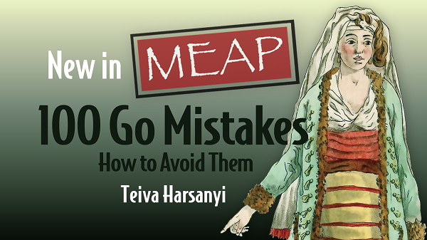

# Teiva Harsanyi

## About Me

I'm a software engineer specializing in backend development and distributed systems. I have extensive experience in designing and implementing resilient, responsive, scalable, and maintainable systems. I love learning, sharing, and facing challenges. Last but not least, I am also an open-source enthusiast.

Main interests:
* Clean code 🧽
* Reliability 🧱
* Performance / Scalability ⚡
* Observability 👀

Languages: Go, Rust, Java

Spoken languages: 🇬🇧, 🇫🇷 

## 100 Go Mistakes

I'm currently writing a book with Manning that will be published in August/September 2022: 100 Go Mistakes.

The main idea is to list 100 of the most common mistakes made by Go developers in various aspects of the language: code and project organization, data structure, loops, error management, concurrency, testing, optimizations, etc.

## Get in Touch

* Twitter: [@teivah](https://twitter.com/teivah)
* Blog: [blog.teivah.io](http://blog.teivah.io)
* Talks: [github.com/teivah/talks](https://github.com/teivah/talks)
* Resume: [teivah.io](http://teivah.io)
* Linkedin: [linkedin.com/in/teiva-harsanyi/](https://www.linkedin.com/in/teiva-harsanyi/)
