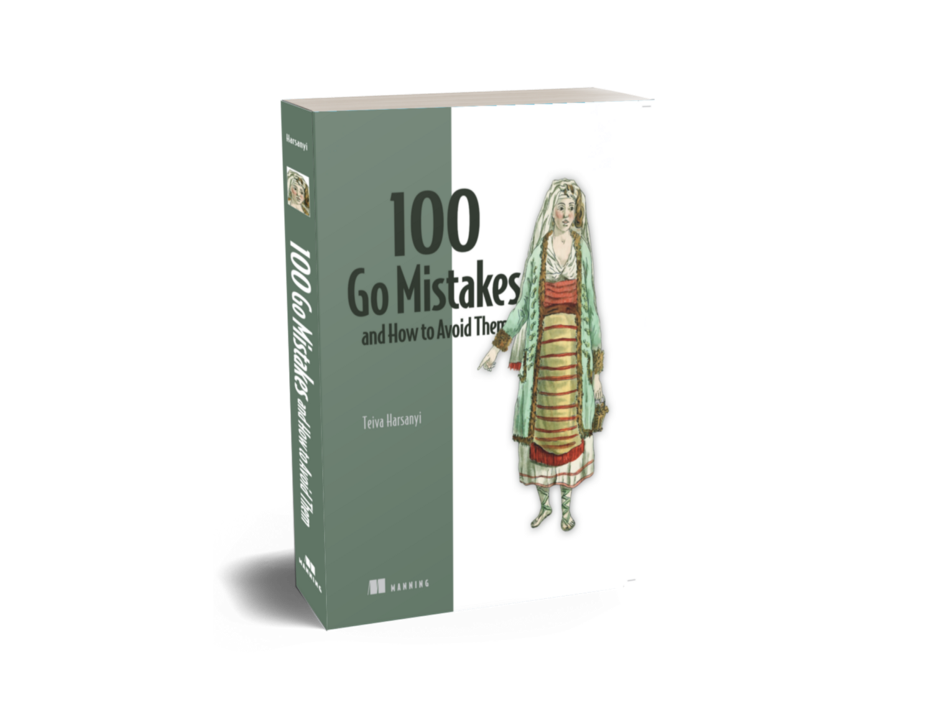

# Teiva Harsanyi

## About Me

I'm a software engineer at Docker, specializing in backend development and distributed systems. I have extensive experience in designing and implementing resilient, responsive, scalable, and maintainable systems. I love learning, sharing, and facing challenges. Last but not least, I am also an open-source enthusiast.

Main interests:
* Clean code 🧽
* Reliability 🧱
* Performance / Scalability ⚡
* Observability 👀

Languages: Go, Rust (learning), Java, Scala

Spoken languages: 🇬🇧, 🇫🇷 

## 📖 100 Go Mistakes and How to Avoid Them

I'm the author of _100 Go Mistakes and How to Avoid Them_ published by Manning in 2022: https://www.manning.com/books/100-go-mistakes-and-how-to-avoid-them.

> _100 Go Mistakes and How to Avoid Them_ shows you how to replace common programming problems in Go with idiomatic, expressive code. In it, you’ll explore dozens of interesting examples and case studies as you learn to spot mistakes that might appear in your own applications.

## Get in Touch

* Twitter: [@teivah](https://twitter.com/teivah)
* Blog: [blog.teivah.io](http://blog.teivah.io)
* Talks: [github.com/teivah/talks](https://github.com/teivah/talks)
* Resume: [teivah.io](http://teivah.io)
* Linkedin: [linkedin.com/in/teiva-harsanyi/](https://www.linkedin.com/in/teiva-harsanyi/)
* Codementor: [codementor.io/@teivaharsanyi](https://www.codementor.io/@teivaharsanyi)

## GitHub Stats

