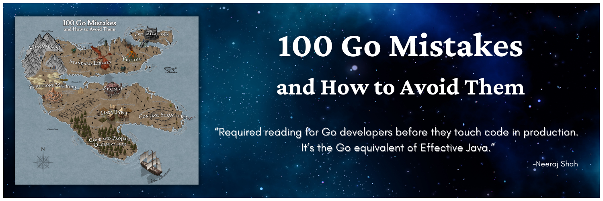

# Teiva Harsanyi

I’m a software engineer specializing in reliability, performance, scalability, and observability topics. I have extensive experience designing and implementing resilient, responsive, scalable, and maintainable systems. I love learning, sharing, and facing challenges. Last but not least, I am also an open-source enthusiast.

Main interests:
* Go
* Distributed systems
* Reliability
* Observability

Meanwhile, I'm the author of _[100 Go Mistakes and How to Avoid Them](https://www.manning.com/books/100-go-mistakes-and-how-to-avoid-them)_ published by Manning in 2022.

